# Introducción a git y GitHub
## Índice

- [Introducción a git y GitHub](#introducción-a-git-y-github)
  - [Índice](#índice)
  - [Pasos detallados](#pasos-detallados)
    - [1. Crear el repositorio local en Windows](#1-crear-el-repositorio-local-en-windows)
    - [2. Añadir archivos al repositorio](#2-añadir-archivos-al-repositorio)
    - [3. Conectar con el repositorio remoto en GitHub](#3-conectar-con-el-repositorio-remoto-en-github)
    - [4. Subir el repositorio local a GitHub](#4-subir-el-repositorio-local-a-github)
    - [5. Clonar el repositorio en Linux Debian](#5-clonar-el-repositorio-en-linux-debian)
    - [6. Modificar archivos y añadir uno nuevo en Windows](#6-modificar-archivos-y-añadir-uno-nuevo-en-windows)
    - [7. Confirmar y subir los cambios al repositorio](#7-confirmar-y-subir-los-cambios-al-repositorio)
    - [8. Actualizar la versión local en Linux Debian](#8-actualizar-la-versión-local-en-linux-debian)

---

## Pasos detallados

### 1. Crear el repositorio local en Windows
Creé un nuevo repositorio local en Windows con `git init`:
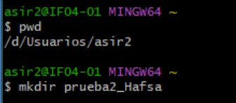

### 2. Añadir archivos al repositorio
Añadí dos archivos de texto, `archivo1.txt` y `archivo2.txt`, con contenido libre.

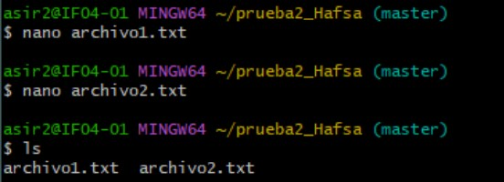

### 3. Conectar con el repositorio remoto en GitHub
Conecté el repositorio local con un repositorio remoto en GitHub usando `git remote add`.

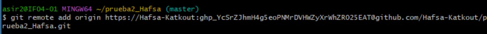

### 4. Subir el repositorio local a GitHub
Subí el repositorio local a GitHub con `git push`.

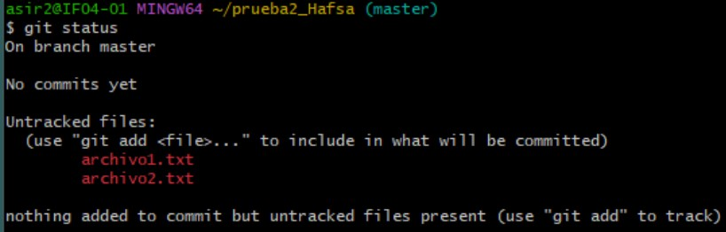

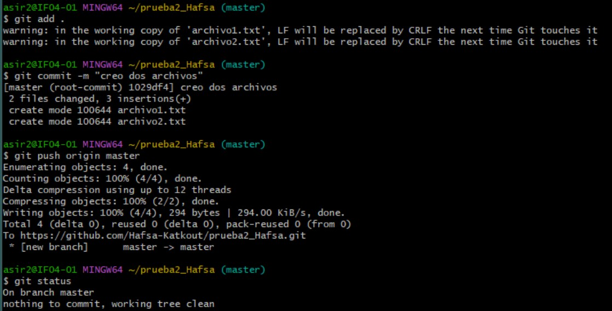

### 5. Clonar el repositorio en Linux Debian
Cloné el repositorio remoto en mi máquina virtual Linux Debian usando `git clone`.

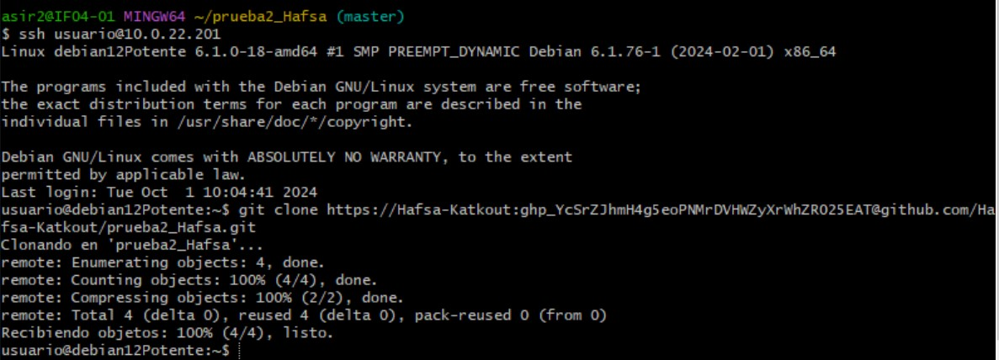

### 6. Modificar archivos y añadir uno nuevo en Windows
Modifiqué en Windows uno de los archivos y añadí un tercer archivo llamado `archivo3.txt`.

modificacion de un archivo:

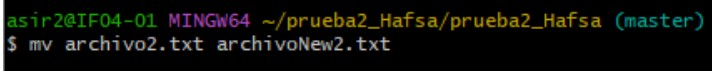

añadir uun archivo :

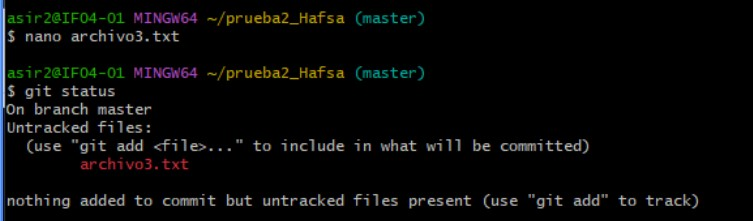

### 7. Confirmar y subir los cambios al repositorio
Confirmé los cambios con `git add` y `git commit`, y subí los cambios al repositorio con `git push`.
subir el archivo nuevo:
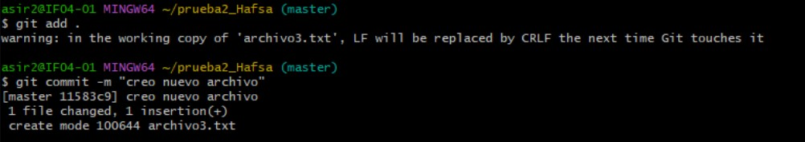

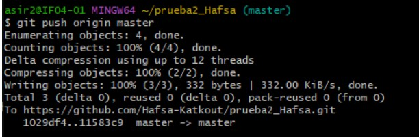

subir los cambios del fichero anterior :

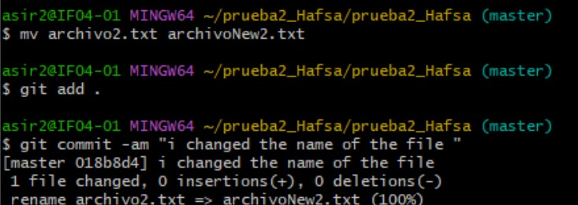

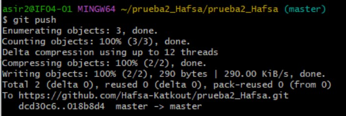

### 8. Actualizar la versión local en Linux Debian
Actualicé la versión local del repositorio en Linux Debian con `git pull`.

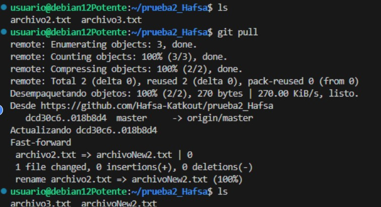