# Trabajando con ramas y uniones
## Índice

- [Trabajando con ramas y uniones](#trabajando-con-ramas-y-uniones)
  - [Índice](#índice)
  - [Listar las ramas locales:](#listar-las-ramas-locales)
  - [Crear una nueva rama :](#crear-una-nueva-rama-)
  - [Listar las ramas :](#listar-las-ramas-)
  - [Pasar a la nueva rama:](#pasar-a-la-nueva-rama)
  - [Comprobar que en la nueva rama hay los mismos ficheros que en la rama principal:](#comprobar-que-en-la-nueva-rama-hay-los-mismos-ficheros-que-en-la-rama-principal)
    - [En la rama 'main' :](#en-la-rama-main-)
    - [En la rama 'rama' :](#en-la-rama-rama-)
  - [Truco: con el comando git checkout -b \[rama\] se crea una nueva rama y te posicionas en ella:](#truco-con-el-comando-git-checkout--b-rama-se-crea-una-nueva-rama-y-te-posicionas-en-ella)
  - [Comprobar que coinciden el último commit en las tres ramas:](#comprobar-que-coinciden-el-último-commit-en-las-tres-ramas)
  - [Modificar algún fichero:](#modificar-algún-fichero)
  - [Crear un nuevo fichero en la rama Hafsa:](#crear-un-nuevo-fichero-en-la-rama-hafsa)
  - [Hacer el commit :](#hacer-el-commit-)
  - [Comprobar que estos cambios no se han reflejado en los ficheros de la rama principal:](#comprobar-que-estos-cambios-no-se-han-reflejado-en-los-ficheros-de-la-rama-principal)
  - [Realizar un push para crearlas en remoto:](#realizar-un-push-para-crearlas-en-remoto)
  - [Para eliminar una rama ejecutamos : *git branch -d \[rama\]* :](#para-eliminar-una-rama-ejecutamos--git-branch--d-rama-)
  - [Unir la rama Hafsa a la principal:](#unir-la-rama-hafsa-a-la-principal)
  - [Hacer un conflicto :](#hacer-un-conflicto-)

---

##  Listar las ramas locales:

## Crear una nueva rama :
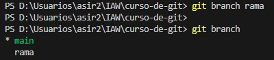
## Listar las ramas :
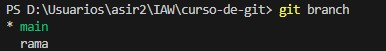
## Pasar a la nueva rama:
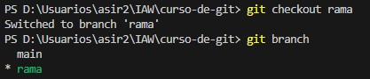

## Comprobar que en la nueva rama hay los mismos ficheros que en la rama principal:

### En la rama 'main' :
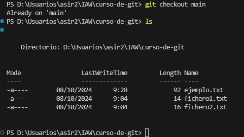

### En la rama 'rama' :
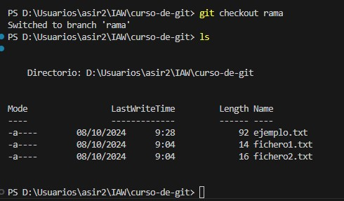

## Truco: con el comando git checkout -b [rama] se crea una nueva rama y te posicionas en ella:
- exemple rama llama : 'Hafsa':
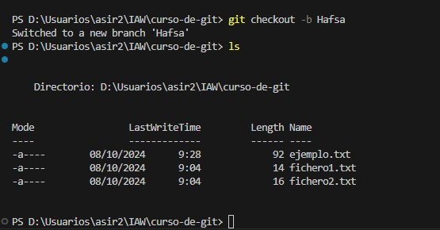

## Comprobar que coinciden el último commit en las tres ramas:
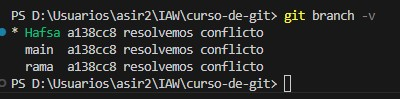

## Modificar algún fichero:
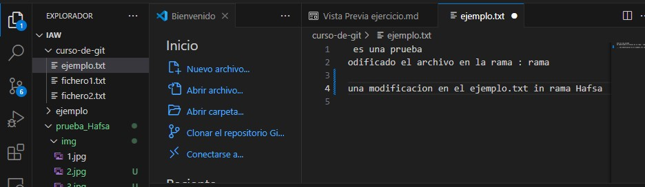
## Crear un nuevo fichero en la rama Hafsa:
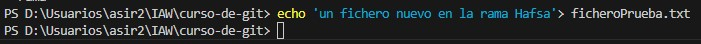

## Hacer el commit :
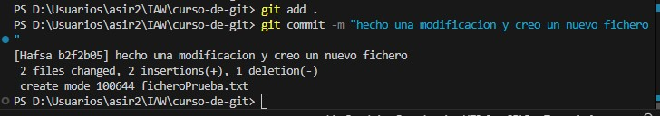

## Comprobar que estos cambios no se han reflejado en los ficheros de la rama principal:

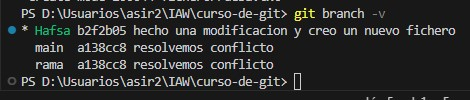

## Realizar un push para crearlas en remoto:
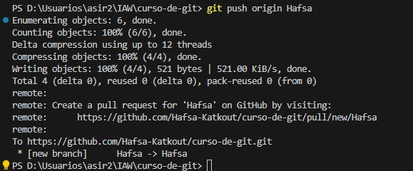
## Para eliminar una rama ejecutamos : *git branch -d [rama]* :

## Unir la rama Hafsa a la principal:

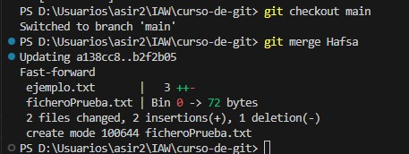

## Hacer un conflicto :
1. Crea un fichero pruebaH.txt en la rama principal main :

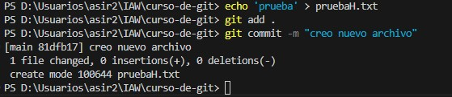

1. AccedeR a la rama Hafsa :

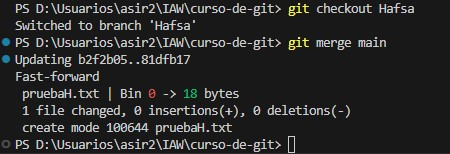
2. Modifica el fichero con un commit:
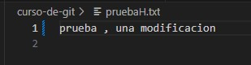
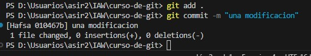

3. Volver a la rama principal. Y modificar de nuevo el fichero antes de realizar el merge :

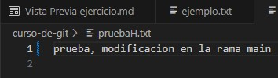
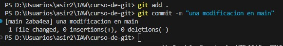

4. Realizar la unión :

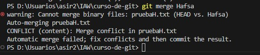

5. Si miramos el fichero:

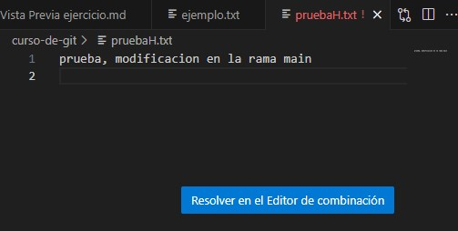

