# Trabajando con ramas y uniones
## índice :
- [Trabajando con ramas y uniones](#trabajando-con-ramas-y-uniones)
  - [índice :](#índice-)
  - [Crear la rama "primera" en el repositorio local](#crear-la-rama-primera-en-el-repositorio-local)
    - [Instrucción para comprobar la creación de la rama](#instrucción-para-comprobar-la-creación-de-la-rama)
  - [Añadir un nuevo fichero en la rama "primera" y fusionarlo con la rama principal](#añadir-un-nuevo-fichero-en-la-rama-primera-y-fusionarlo-con-la-rama-principal)
    - [Explicación del proceso:](#explicación-del-proceso)
    - [¿Se ha producido conflicto?](#se-ha-producido-conflicto)
    - [Razón de la respuesta](#razón-de-la-respuesta)
  - [Eliminar la rama "primera"](#eliminar-la-rama-primera)
  - [Crear la rama "segunda" y provocar un conflicto](#crear-la-rama-segunda-y-provocar-un-conflicto)
    - [Modificación del fichero para generar un conflicto](#modificación-del-fichero-para-generar-un-conflicto)
  - [Resolver el conflicto y sincronizar la rama "segunda" en GitHub](#resolver-el-conflicto-y-sincronizar-la-rama-segunda-en-github)
    - [Solución del conflicto](#solución-del-conflicto)
    - [Sincronización de la rama en el repositorio remoto](#sincronización-de-la-rama-en-el-repositorio-remoto)
    - [Captura de pantalla del repositorio en GitHub mostrando la creación de la rama](#captura-de-pantalla-del-repositorio-en-github-mostrando-la-creación-de-la-rama)

---

## Crear la rama "primera" en el repositorio local

 Usando el comando `git branch -b primera`

  ### Instrucción para comprobar la creación de la rama
Usando el comando `git branch`

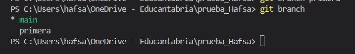

## Añadir un nuevo fichero en la rama "primera" y fusionarlo con la rama principal

   ### Explicación del proceso:
 Primero, añadir un nuevo archivo en la rama "primera" , por ejemplo llamarlo `archivo.txt`

   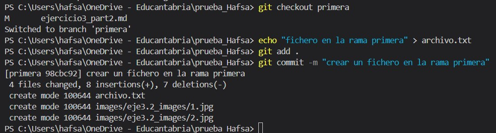

Luego, cambiar a la rama principal main:

Ahora, fusionar la rama "primera" con la rama principal :
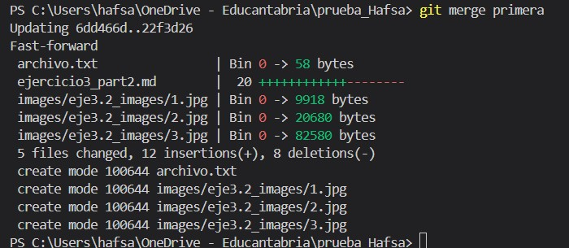

   ### ¿Se ha producido conflicto?
      No 

   ### Razón de la respuesta
porque no hay modificaciones simultáneas en los mismos archivos desde ambas ramas.

## Eliminar la rama "primera"
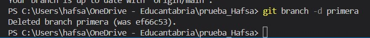

## Crear la rama "segunda" y provocar un conflicto
primero creamos la rama `segunda` :

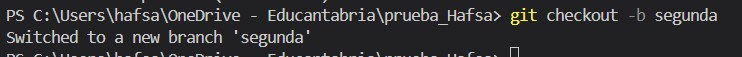

   ### Modificación del fichero para generar un conflicto
   modificamos el fichero dentro de la rama `segunda` :

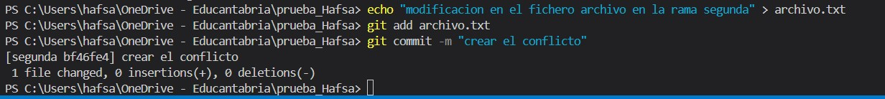

entramos en el mismo archivo desde la rama main y hacemos modificacion : 

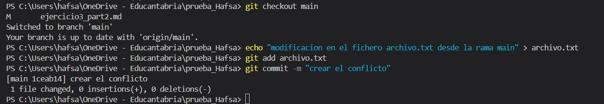

hacemos `git merge segunda`: y nos da el **conflicto** :

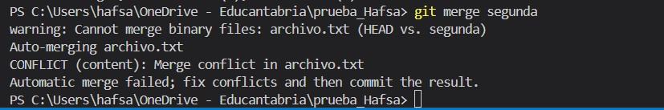

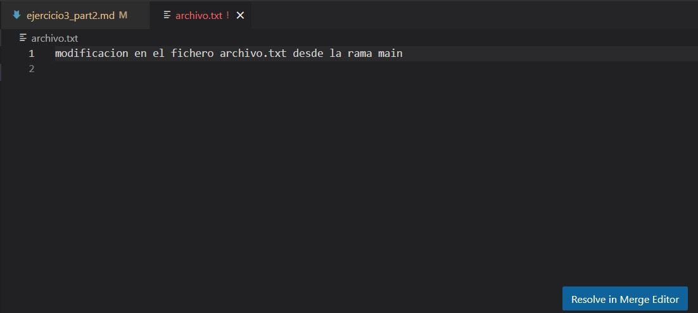

## Resolver el conflicto y sincronizar la rama "segunda" en GitHub

   ### Solución del conflicto
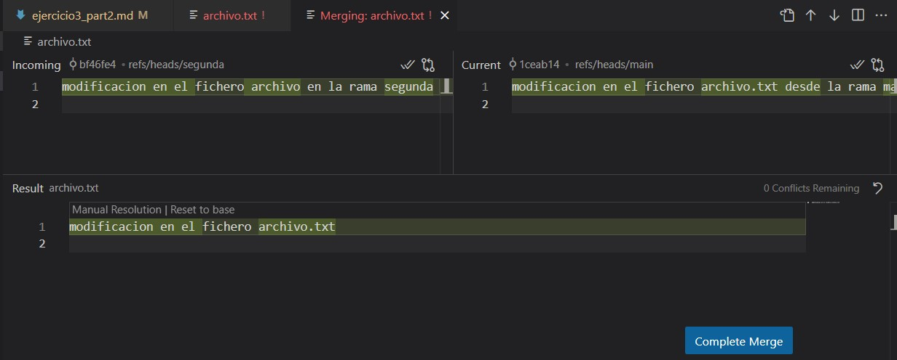

   ### Sincronización de la rama en el repositorio remoto
   
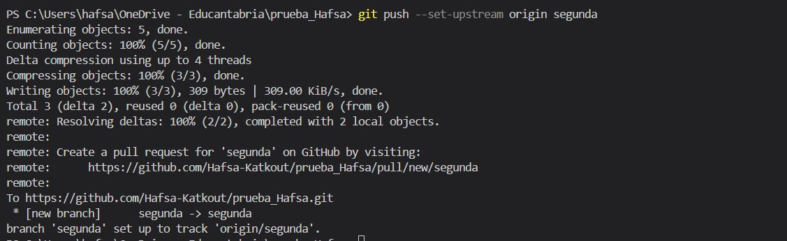

   ### Captura de pantalla del repositorio en GitHub mostrando la creación de la rama

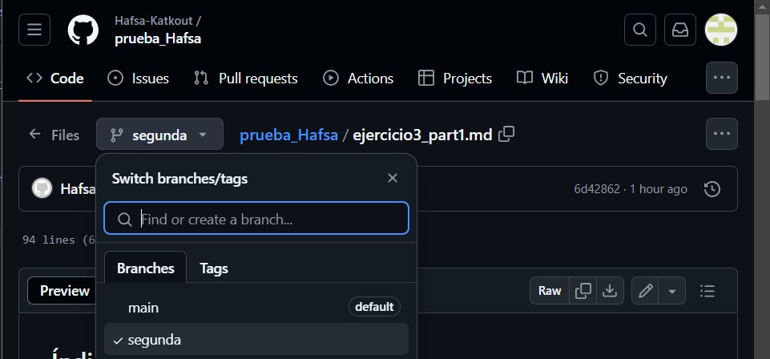
