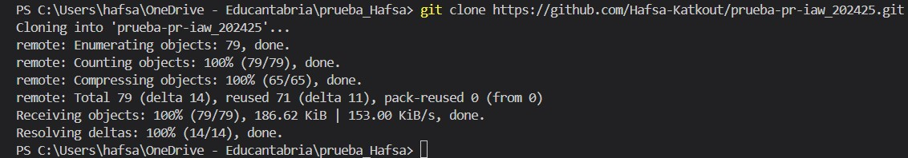

# ¿Cómo colaborar en un proyecto de software libre? ¿Qué es un Pull Request (PR)?

- [¿Cómo colaborar en un proyecto de software libre? ¿Qué es un Pull Request (PR)?](#cómo-colaborar-en-un-proyecto-de-software-libre-qué-es-un-pull-request-pr)
  - [Realizar un fork del repositorio](#realizar-un-fork-del-repositorio)
    - [Instrucciones para clonar el repositorio en tu cuenta](#instrucciones-para-clonar-el-repositorio-en-tu-cuenta)
  - [Modificar el fichero README.md](#modificar-el-fichero-readmemd)
    - [Añadir enlace a HKA en la lista, apuntando al fichero creado](#añadir-enlace-a-hka-en-la-lista-apuntando-al-fichero-creado)
  - [Crear el fichero HKA.md en el directorio "files"](#crear-el-fichero-hkamd-en-el-directorio-files)
    - [Responder las preguntas en formato Markdown:](#responder-las-preguntas-en-formato-markdown)
  - [Realizar el commit y preparar el pull request](#realizar-el-commit-y-preparar-el-pull-request)
    - [Crear un commit con un mensaje significativo](#crear-un-commit-con-un-mensaje-significativo)
    - [Detallar cómo realizar el pull request al repositorio original](#detallar-cómo-realizar-el-pull-request-al-repositorio-original)
  - [Sincronizar el repositorio local](#sincronizar-el-repositorio-local)
    - [Instrucciones para sincronizar el repositorio local con los cambios aceptados por el propietario](#instrucciones-para-sincronizar-el-repositorio-local-con-los-cambios-aceptados-por-el-propietario)

---

## Realizar un fork del repositorio

### Instrucciones para clonar el repositorio en tu cuenta
1. En el repositorio en el enlace :
https://github.com/lgarciavelazquez/prueba-pr-iaw_202425

2. hacemos clic en Fork :

3. Luego creamos el Fork:

4. Clonar el repositorio en mi máquina local:
   
   

## Modificar el fichero README.md

### Añadir enlace a HKA en la lista, apuntando al fichero creado 

## Crear el fichero HKA.md en el directorio "files"

### Responder las preguntas en formato Markdown:

## Realizar el commit y preparar el pull request

### Crear un commit con un mensaje significativo

### Detallar cómo realizar el pull request al repositorio original
. En mi repositorio en GitHub hago clic en "Compare & pull request" para iniciar el proceso de pull request

. hago clic en 'new':

. comprobamos que todo est bien :

. añadir el mensaje del pull request :

## Sincronizar el repositorio local

### Instrucciones para sincronizar el repositorio local con los cambios aceptados por el propietario 
